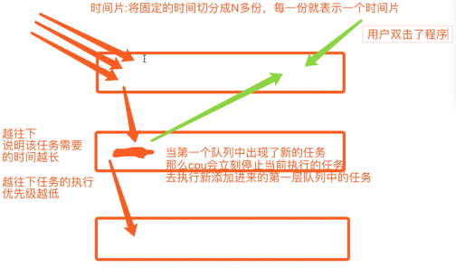
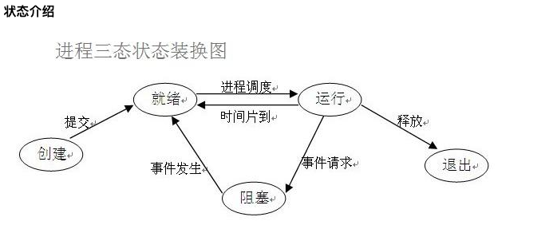
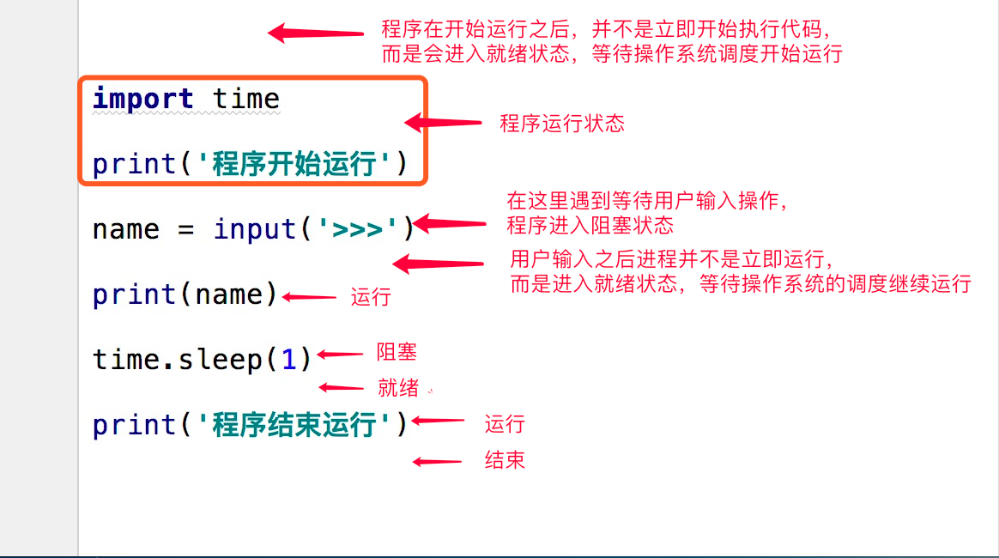

# 进程理论

博客地址：https://www.cnblogs.com/Dominic-Ji/articles/10929384.html

### 必备知识点

程序与进程的区别

```python
"""
程序就是一堆躺在硬盘上的代码，是“死”的
进程则表示程序正在执行的过程，是“活”的
"""
```

### 进程调度

* 先来先服务调度算法

  ```python
  """对长作业有利，对短作业无益"""
  ```

* 短作业优先调度算法

  ```python
  """对短作业有利，多长作业无益"""
  ```

* 时间片轮转法+多级反馈队列



### 进程运行的三状态图





### 两对重要概念

* **同步和异步**

```python
  """描述的是任务的提交方式"""
  同步:任务提交之后，原地等待任务的返回结果，等待的过程中不做任何事(干等)
    	程序层面上表现出来的感觉就是卡住了
  
  异步:任务提交之后，不原地等待任务的返回结果，直接去做其他事情
    	我提交的任务结果如何获取？
      任务的返回结果会有一个异步回调机制自动处理
  ```

* **阻塞非阻塞**

  ```python
  """描述的程序的运行状态"""
  阻塞:阻塞态
  非阻塞:就绪态、运行态
  
  理想状态:我们应该让我们的写的代码永远处于就绪态和运行态之间切换
  ```

上述概念的组合:最高效的一种组合就是**异步非阻塞**


## 开启进程的两种方式

定心丸:代码开启进程和线程的方式，代码书写基本是一样的，你学会了如何开启进程就学会了如何开启线程

```PYTHON
from multiprocessing import Process
import time


def task(name):
    print('%s is running'%name)
    time.sleep(3)
    print('%s is over'%name)


if __name__ == '__main__':
    # 1 创建一个对象
    p = Process(target=task, args=('jason',))
    # 容器类型哪怕里面只有1个元素 建议要用逗号隔开
    # 2 开启进程
    p.start()  # 告诉操作系统帮你创建一个进程  异步
    print('主')
    
    
# 第二种方式 类的继承
from multiprocessing import Process
import time


class MyProcess(Process):
    def run(self):
        print('hello bf girl')
        time.sleep(1)
        print('get out!')


if __name__ == '__main__':
    p = MyProcess()
    p.start()
    print('主')
```


**总结**

```python
"""
创建进程就是在内存中申请一块内存空间将需要运行的代码丢进去
一个进程对应在内存中就是一块独立的内存空间
多个进程对应在内存中就是多块独立的内存空间
进程与进程之间数据默认情况下是无法直接交互,如果想交互可以借助于第三方工具、模块
"""
```


